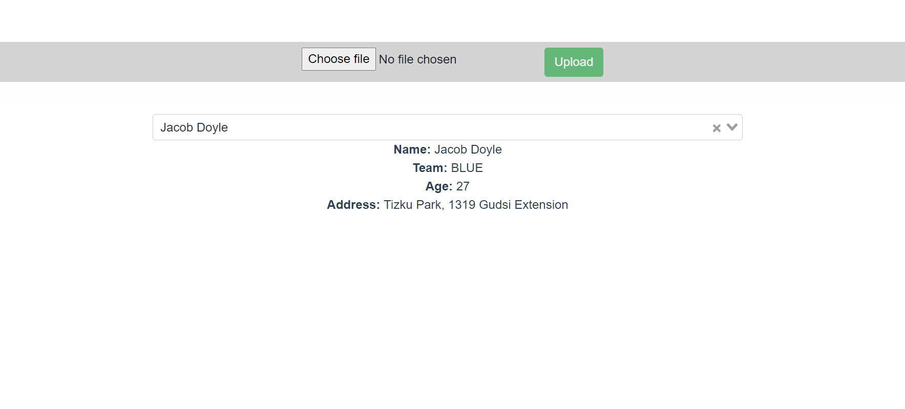

# tubeDrive-app
## Building a Full Stack CSV parsing app with Nodejs, Express, Vue.js



1. **Clone the application**

	```bash
	git clone https://github.com/Shpakovsky94/tubeDrive-app.git
	cd 02-backend
	```

2. **Run the app**

	You can run the node.js app by typing the following command -

	```bash
	npm install && npm start

	```

	The server will start on port 8081.

## Steps to Setup the Vue.js Front end app (03-frontend)

First go to the `03-frontend` folder -

```bash
cd 03-frontend
```

Then type the following command to install the dependencies and start the application -

```bash
npm install -g @vue/cli
npm install && npm run start
```

The front-end server will start on port `8080`.
